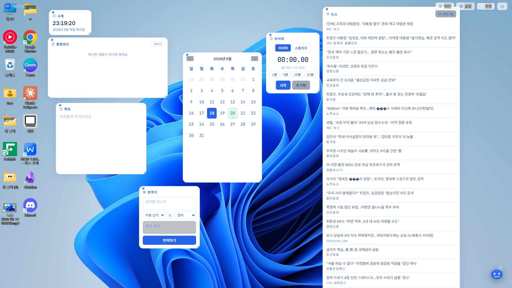

# WCW — Windows Connecting the World

**바탕화면에 원하는 위젯을 그대로 올려두는, 무료 오픈소스 윈도우 위젯 앱**

시계, 할일 목록, 메모, 주식, 환율, 뽀모도로 타이머 등 24가지 위젯을 클릭 한 번으로 바탕화면에 배치하고 자유롭게 꾸밀 수 있습니다.

[](https://github.com/dortomyork09-cyber/WCW-widget/releases)
[](./LICENSE.md)
[](https://github.com/dortomyork09-cyber/WCW-widget/releases)

[웹사이트](https://dortomyork09-cyber.github.io/WCW-widget/) · [다운로드](https://github.com/dortomyork09-cyber/WCW-widget/releases) · [Instagram](https://www.instagram.com/wcw_widget)

---

## 왜 WCW인가요

- **완전 무료** — 결제, 구독, 계정 가입 전부 없음
- **오픈소스** — 코드 전체가 공개돼 있어서 뭘 하는 앱인지 직접 확인 가능
- **가벼움** — Electron 기반 단일 실행 파일(portable), 설치 과정 없이 바로 실행
- **커스터마이징** — 위젯마다 위치/크기 자유 배치, 필요한 것만 골라서 사용

## 위젯 목록 (24개)

| 카테고리 | 위젯 |
|---|---|
| 기본 | 시계, 달력, 링크 |
| 기록 | 할일, 메모, 습관, 카운터, 클립보드 |
| 정보 | 뉴스, 환율, 주식, 스포츠 |
| 도구 | 타이머, 뽀모도로, 계산기, 단위변환, D-day, 번역기, 색상 피커, 그래프, 바로가기 런처 |
| 재미 | 명언, 주사위, 스네이크 게임 |

## 스크린샷



## 다운로드 및 실행

1. [Releases](https://github.com/dortomyork09-cyber/WCW-widget/releases) 페이지에서 최신 `WCW-x.x.x.exe` 다운로드
2. 실행 (Windows SmartScreen 경고가 뜰 수 있음 — 서명되지 않은 소규모 오픈소스 앱이라 발생하는 정상적인 경고이며, 아래 안내를 참고)
3. 우클릭 메뉴 또는 트레이 아이콘으로 원하는 위젯 추가

Windows SmartScreen 경고가 걱정된다면, 이 저장소의 코드를 직접 확인하거나 [VirusTotal 스캔 결과](https://www.virustotal.com)로 안전성을 검증할 수 있습니다.

## 소스에서 직접 빌드하기

```bash
git clone https://github.com/dortomyork09-cyber/WCW-widget.git
cd WCW-widget
npm install
npm start          # 개발 모드로 실행
npm run build       # portable exe 빌드 (dist 폴더에 생성됨)
```

## 기술 스택

- [Electron](https://www.electronjs.org/)
- Vanilla JavaScript / HTML / CSS

## 라이선스

[LICENSE.md](./LICENSE.md) 참고

## 링크

- 웹사이트: https://dortomyork09-cyber.github.io/WCW-widget/
- Instagram: [@wcw_widget](https://www.instagram.com/wcw_widget)
- 이슈 / 버그 제보: [GitHub Issues](https://github.com/dortomyork09-cyber/WCW-widget/issues)
